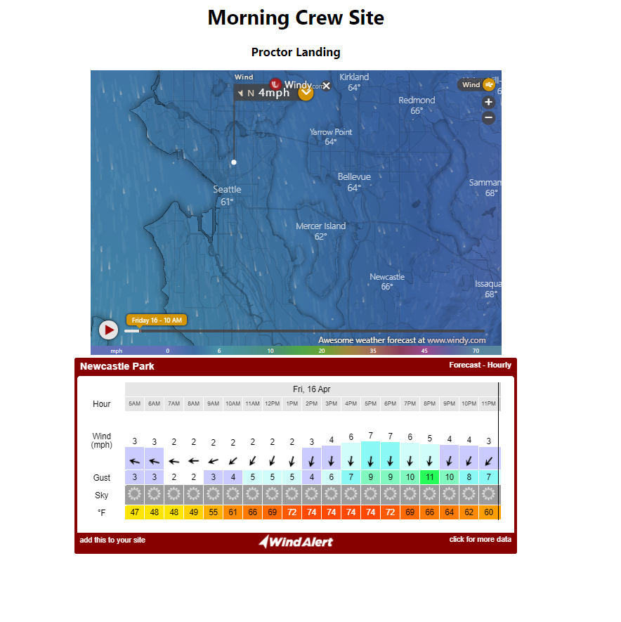

# Proctor Weather App

The Morning Crew - A handful of rad people who like to get up at the crack of dawn to paddle stand up paddleboards, prone paddleboards, and outrigger canoes. Proctor landing is our offical launch spot. This app pulls from a few different API's to get the most indepth weather data for our paddling adventures.

Early snap shot. Pulling from Windy API and WindAlert. Adding more styling and functionality.

